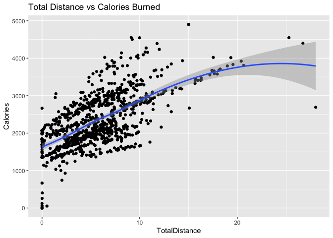
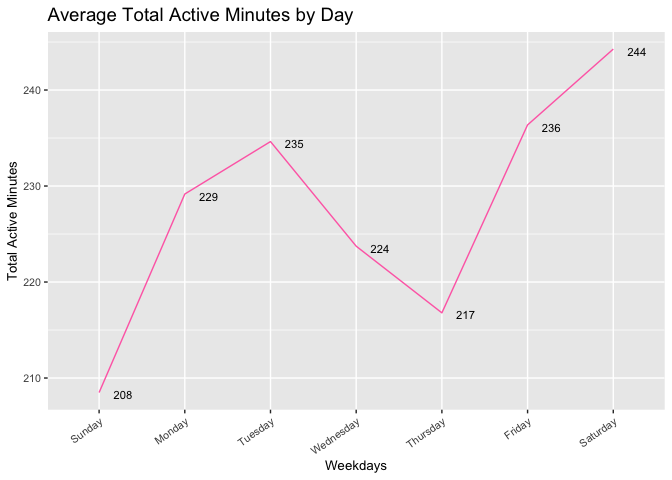

Bellabeat
================
Brittny Huggins
09/26/2021


## Introduction

Bellabeat is a high-tech company that manufactures health-focused smart
products. These smart devices collects data on activity, sleep, stress,
and reproductive health.These features allowed Bellabeat to empower
women with knowledge about their own health and habits. Bellabeat has
grown rapidly and quickly positioned itself as a tech-driven wellness
company for women.

## Buisness Task and Questions to Answer

Analyze smart device data to gain insights on usage and recognize
trends.

> Questions

1.  What are some trends in smart device usage?

2.  How could these trends apply to Bellabeat customers?

3.  How could these trends help influence Bellabeat marketing strategy?

## Prepare

**Data Source** [Fitbit Dataset](https://www.kaggle.com/arashnic/fitbit)
(CC0: Public Domain, dataset made available through)

[Möbius](https://www.kaggle.com/arashnic)

-   18 Datasets were generated,and these sets were generated by
    respondents to a distributed survey via Amazon Mechanical Turk
    between 03.12.2016-05.12.2016.

-   33 eligible Fitbit users (although daily activity shows 33 unique
    Id’s) consented to the submission of personal tracker data,
    including minute-level output for physical activity, heart rate, and
    sleep monitoring.

## Process

First, I installed the neccesary package for analysis

``` r
options(repos = list(CRAN="http://cran.rstudio.com/"))

   install.packages("tidyverse")
```

    ## 
    ## The downloaded binary packages are in
    ##  /var/folders/p_/n9dk52q92ld5svrw21rdqf7w0000gn/T//RtmpObZRAP/downloaded_packages

``` r
   install.packages("lubridate")
```

    ## 
    ## The downloaded binary packages are in
    ##  /var/folders/p_/n9dk52q92ld5svrw21rdqf7w0000gn/T//RtmpObZRAP/downloaded_packages

``` r
   library(tidyverse)
```

    ## ── Attaching packages ─────────────────────────────────────── tidyverse 1.3.1 ──

    ## ✓ ggplot2 3.3.5     ✓ purrr   0.3.4
    ## ✓ tibble  3.1.6     ✓ dplyr   1.0.7
    ## ✓ tidyr   1.1.4     ✓ stringr 1.4.0
    ## ✓ readr   2.1.2     ✓ forcats 0.5.1

    ## ── Conflicts ────────────────────────────────────────── tidyverse_conflicts() ──
    ## x dplyr::filter() masks stats::filter()
    ## x dplyr::lag()    masks stats::lag()

``` r
   library(lubridate)
```

    ## 
    ## Attaching package: 'lubridate'

    ## The following objects are masked from 'package:base':
    ## 
    ##     date, intersect, setdiff, union

Then I loaded the CSV files to start my analysis. Out of the 18 sets I
only loaded Daily Activity and Sleep because they gave me the most
valuable data for analysis.

``` r
  daily_activity <-read.csv("dailyActivity_merged.csv")
 sleep_day <- read.csv("sleepDay_merged.csv")
```

**How many unique participants are in each data set?**

``` r
n_distinct(daily_activity$Id)
```

    ## [1] 33

``` r
n_distinct(sleep_day$Id)
```

    ## [1] 24

**How many rows are in each dataset?**

``` r
nrow(daily_activity)
```

    ## [1] 940

``` r
nrow(sleep_day)
```

    ## [1] 413

**Findings**

-   Daily_Activty: 33 distinct users and 940 rows
-   Sleep_day: 24 distinct users and 413 rows

**Note:** The number of users from each set doesn’t match meaning that
some participants didn’t log their sleep habits.

### Cleaning and Manipulating Data

#### Daily_activity

**Find Dupilcates**

``` r
sum(duplicated(daily_activity))
```

    ## [1] 0

**Alter Date column **

``` r
colnames(daily_activity)[colnames(daily_activity) == "ActivityDate"] <- "Date"
```

``` r
daily_activity$Date <-  as.Date(daily_activity$Date,format='%m/%d/%Y')
```

**Add in a days of the week column**

``` r
daily_activity$Weekdays<- wday(daily_activity$Date, label = TRUE, abbr = FALSE)
```

**Add Total Active Minutes to updated daily activity(daily_activity2) **

``` r
daily_activity2 <- daily_activity %>% 
  mutate(TotalActiveMinutes = VeryActiveMinutes + FairlyActiveMinutes + LightlyActiveMinutes)
```

#### Sleep Day

**Find & remove duplicates **

``` r
sum(duplicated(sleep_day))
```

    ## [1] 3

**Remove duplicates**

``` r
sleep_day <- sleep_day %>%
  distinct() %>%
  drop_na()
```

## Analyze

First, I analyzed the summary statistics of each data frame.

**Daily Activity Data frame**

``` r
daily_activity %>%  
  select(TotalSteps,
         TotalDistance,
         SedentaryMinutes) %>%
  summary()
```

    ##    TotalSteps    TotalDistance    SedentaryMinutes
    ##  Min.   :    0   Min.   : 0.000   Min.   :   0.0  
    ##  1st Qu.: 3790   1st Qu.: 2.620   1st Qu.: 729.8  
    ##  Median : 7406   Median : 5.245   Median :1057.5  
    ##  Mean   : 7638   Mean   : 5.490   Mean   : 991.2  
    ##  3rd Qu.:10727   3rd Qu.: 7.713   3rd Qu.:1229.5  
    ##  Max.   :36019   Max.   :28.030   Max.   :1440.0

**Sleep Day Dataframe**

``` r
sleep_day %>%  
  select(TotalSleepRecords,
  TotalMinutesAsleep,
  TotalTimeInBed) %>%
  summary()
```

    ##  TotalSleepRecords TotalMinutesAsleep TotalTimeInBed 
    ##  Min.   :1.00      Min.   : 58.0      Min.   : 61.0  
    ##  1st Qu.:1.00      1st Qu.:361.0      1st Qu.:403.8  
    ##  Median :1.00      Median :432.5      Median :463.0  
    ##  Mean   :1.12      Mean   :419.2      Mean   :458.5  
    ##  3rd Qu.:1.00      3rd Qu.:490.0      3rd Qu.:526.0  
    ##  Max.   :3.00      Max.   :796.0      Max.   :961.0

**Summary Analysis**

-   The average number of steps taken per day by participants is 7,638,
    and the average Total distance traveled is about 5.5 miles.

-   Sedentary minutes is averaging at 991.2 minutes/ 16.5 hours.

-   Total Minutes Asleep is averaging at 419.2 minutes/ about 7 hours.

Next, I analyzed some more trends from the Daily Activity and the Daily
Activty2 dataframe.

``` r
ggplot(data=daily_activity, aes(x=TotalDistance, y=Calories)) + geom_point() + geom_smooth(method= "loess") + labs(title = "Total Distance vs Calories Burned")
```

    ## `geom_smooth()` using formula 'y ~ x'

<!-- -->

Finally, I looked into participants total daily activity average
(combined light Active minutes, fairly active minutes, and very active
minutes) and see how they related to the days of the week.

``` r
average_total_active_minutes <- daily_activity2 %>% 
  group_by(Weekdays) %>% 
  summarise_at(vars(TotalActiveMinutes),
               list(TotalActiveMinutes = mean))

ggplot(data=average_total_active_minutes, aes(x=Weekdays,y=TotalActiveMinutes, group=1))+ geom_line(color = "hotpink1")+   labs(title="Average Total Active Minutes by Day", x= "Weekdays", y="Total Active Minutes")+
geom_text(aes(label=round(TotalActiveMinutes, digits=0), hjust=-0.75, vjust=0.75),size=3)+
 theme(plot.title = element_text(size=14), text = element_text(size=10), axis.text.x = element_text(angle=35, hjust=1))
```

<!-- -->

**From the chart I found that:**

-   Users worked out the least on **Sundays** and **Thursdays**
-   Users worked out the most on **Fridays** and **Saturdays**.

## Limitations

Data was only taken over a short period of time (30 days). To get an
even better understanding of how users are using smart devices we may
need a longer time frame to analyze. Also since some users didn’t report
some information or didn’t wear their device it, their information
couldn’t be used for analysis. Finally, the study only included thirty
year olds. To get a wider range of data, we should survey Bellabeat
users of all ages.

## Trends

-   Participants daily activities are logged the most probably because
    the device logs most of their activity without them actually doing
    anything.

-   Most people work out the most Fridays and Saturdays and the least on
    Sundays and Thursdays.

-   Most participants are getting in at least 6-7 hours of sleep.

## Marketing Action

-   According to [the National Institution of
    health](https://www.nih.gov/news-events/nih-research-matters/how-many-steps-better-health)
    only about 7,500 steps are needed to lower mortality rate and to
    live a healthier life. Although a lot users in the study were
    reaching that, there were some who didn’t.Bellabeat devices already
    show total steps, but they should have a feature that offers
    incentives for reaching daily step goals. People would be a lot more
    inclined to get moving.

-   There isn’t much information about how much sedentary time is too
    much, but Just Stand.org [Just
    Stand.org](https://www.juststand.org/the-tools/sitting-time-calculator/) says
    that on average we sit for 7.7 hours a day. Users in the study were
    averaging about 16.5 hours a day. Long periods of sitting have been
    linked to obesity, heart disease, high blood pressure, diabetes, and
    more. Bellabeat should add reminders on devices to get users moving
    after long periods of time.Also, add in the reminders “Did you
    know..”’s that have facts about the effects of spending too much
    time lounging.

-   Since daily activity is low on certain days, Bellabeat can implement
    an app with workout competitions so that on a daily basis they can
    see their friends activities which can motivate them to get up and
    move on those days they’re feeling lazy. Even add a feature where
    users can go on live with workouts so others can join from home to
    get moving!

## Further Research

-   For a more extensive analysis more participants should be surveyed
    and more ages should be included. Also more information about
    reproductive health from devices would be beneficial since Bellabeat
    advertises products to mostly women.
