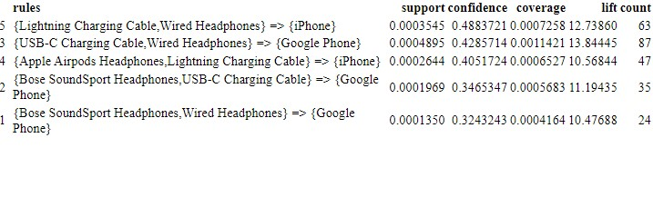
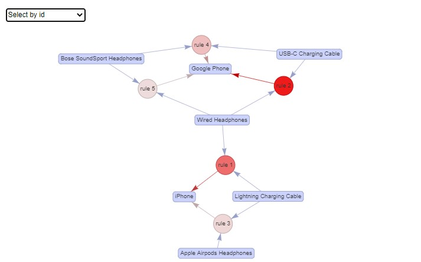

```{r include=FALSE,source("C:/Rscripts/source.R")}


suppressPackageStartupMessages(install.packages("lubridate"))
suppressPackageStartupMessages(install.packages("xts"))
suppressPackageStartupMessages(install.packages("plyr"))
library(xts)
library(lubridate)
library(dplyr)
library(stringr)
library(plyr)


```

```{r include=FALSE}
#Data importation and combining all data tables 
jan <- read.csv("Sales_January_2019.csv")
 feb <- read.csv("Sales_February_2019.csv")
 march <- read.csv("Sales_March_2019.csv")
 april <- read.csv("Sales_April_2019.csv")
 may <- read.csv("Sales_May_2019.csv")
 june <- read.csv("Sales_June_2019.csv")
 july <- read.csv("Sales_July_2019.csv")
 aug <- read.csv("Sales_August_2019.csv")
 sept <- read.csv("Sales_September_2019.csv")
 oct <- read.csv("Sales_October_2019.csv")
 nov <- read.csv("Sales_November_2019.csv")
 dec <- read.csv("Sales_December_2019.csv")
 
 #Removing rows containing wrong values 
jan <- jan %>% filter(Order.ID != "Order ID")
feb <- feb %>% filter(Order.ID != "Order ID")
 march <- march %>% filter(Order.ID != "Order ID")
 april <- april %>% filter(Order.ID != "Order ID")
 may <- may %>% filter(Order.ID != "Order ID")
 june <-june %>% filter(Order.ID != "Order ID")
 july <- july %>% filter(Order.ID != "Order ID")
 aug <- aug %>% filter(Order.ID != "Order ID")
 sept <- sept %>% filter(Order.ID != "Order ID")
 oct <- oct %>% filter(Order.ID != "Order ID")
 nov <- nov %>% filter(Order.ID != "Order ID")
 dec <- dec %>% filter(Order.ID != "Order ID")


 df <- do.call("rbind", list(jan,feb,march,april,may,june,july,aug,sept,oct,nov,dec))
```

```{r include=FALSE}
#checks for duplicated values
which(duplicated(df))


#removes those values 
df_no_dup <- df[!duplicated(df),]


#check for missing values 
sum(is.na(df_no_dup))

```


```{r include=FALSE}
df <- df_no_dup

#Convert Date column 
df$Order.Date<- as.POSIXct(df$Order.Date,format="%m/%d/%Y %H:%M")

# Convert Quantity Ordered Column 
df$Quantity.Ordered <- as.numeric(df$Quantity.Ordered)

#Add month name column 
df$month <- format(df$Order.Date,"%B")

#Convert Order.Date to standard time with am/pm 
df$datehour <- format(df$Order.Date, "%Y-%m-%d %I:%M:%S %p")
df$datehour <- as.POSIXct(df$datehour)

#Seperate Datehour column for further analysis 
df[c("new_date", "time", "ap")] <- stringr::str_split_fixed(df$datehour, ' ', 3)

#Split address column into seperate columns
df[c("Address", "City", "State")] <- str_split_fixed(df$Purchase.Address, ',', 3)

#Convert Price.Each column 
df$Price.Each <- as.numeric(df$Price.Each)

# Adds earnings column to dataframe
df$Sales.Totals.Price <- (df$Quantity.Ordered*df$Price.Each)


```


## What products are most often sold together?

The final objective was to find insights more products being sold together. The best way to answer the above question is to perform a market basket analysis. A market basket analysis is an unsupervised machine learning technique that finds out which products are being bought together by customers. The technique works by searching for combinations of items that often happen in transactions together. A Market Basket Analysis is a useful tool for retailers who want to better understand the relationships between the products that people buy. 




The market basket established five association rules that can be read as: 

If a customer purchases lightning charging cables and wired headphones, they will also buy an Iphone 48% of the time. An Iphone is 12.74 times more likely to be sold alongside lightning charging cables and wired headphones. 63 transactions included all three items.

If a customer purchases an USB-C charging cable and wired headphones are, they will also purchase a Google phone about 43% of the time. A Google phone is 13.84 times more likely to be sold alongside an USB-C charging cable and wired headphones. 87 transactions included all three items. 

If a customer purchases Apple air pods headphones and a lightning charging cable, they will also purchase an Iphone 40% of the time. An Iphone is 10.57 times more likely to be sold alongside a pair of Apple air pods and a lightning charging cable. 47 transactions had all three items. 

If a customer purchases Bose soundsport headphones and a USB-C charging cable, they will also purchase a Google phone about 34% of the time. A Google phone is 11.19 times more likely to be sold alongside Bose soundsport headphones and a USB-C charging cable. 35 transactions had all three items. 

If a customer purchases Bose soundsport headphones and wired headphones, they will also purchase a Google phone about 32% of the time. A Google phone is 10.48 times more likely to be sold alongside Bose soundsport headphones and wired headphones. 24 transactions had all three of these items. 

here is a network map of the associations. 



  The network graph above visualizes the associations between selected items. Larger circles imply higher support. Support is the percentage as of transactions contain the combination of items A and B. Red circles imply higher lift. The higher the lift, the higher the chance of product A and product B occurring together. For example, rule 2 has the brightest red circle so that means there's a higher chance of customers also purchasing a Google phone when they are purchasing wired headphones and a USB-C charging cable.  
  
## Technical Annex
```{r eval=FALSE}


#market basket 
sorted <- df[order(df$Order.ID),]
sorted <- sorted %>% na.omit()
sorted$Order.ID <- as.numeric(sorted$Order.ID)
itemList <- ddply(df, c("Order.ID","new_date"), function(df)paste(df$Product,collapse = ","))

itemList$Order.ID <- NULL
itemList$new_date <- NULL

colnames(itemList) <- c("itemList")

write.csv(itemList,"ItemList.csv", quote = FALSE, row.names = TRUE)

txn <- read.transactions(file="ItemList.csv", rm.duplicates= TRUE, format="basket",sep=",",cols=1);

txn@itemInfo$labels <- gsub("\"","",txn@itemInfo$labels)

 basket_rules <- apriori(txn,parameter = list(minlen=2,sup = 0.0001, conf = 0.3,target="rules"))

basket_rules<-sort(basket_rules, by="confidence", decreasing=TRUE)

df_basket <- as(basket_rules,"data.frame")
knitr::kable(df_basket)


#interactive network chart
subrules <- head(basket_rules, n = 5, by = "confidence")
 plot(subrules, method = "graph",  engine = "htmlwidget")

```

