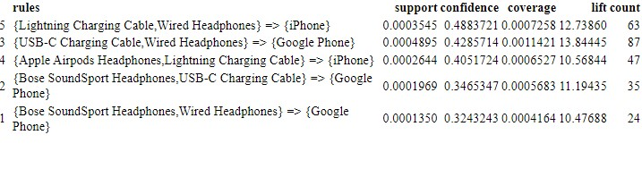

Retailer Market Basket Analysis
================

## What products are most often sold together?

The final objective was to find insights more products being sold
together. The best way to answer the above question is to perform a
market basket analysis. A market basket analysis is an unsupervised
machine learning technique that finds out which products are being
bought together by customers. The technique works by searching for
combinations of items that often happen in transactions together. A
Market Basket Analysis is a useful tool for retailers who want to better
understand the relationships between the products that people buy.



The market basket established five association rules that can be read
as:

If a customer purchases lightning charging cables and wired headphones,
they will also buy an Iphone 48% of the time. An Iphone is 12.74 times
more likely to be sold alongside lightning charging cables and wired
headphones. 63 transactions included all three items.

If a customer purchases an USB-C charging cable and wired headphones
are, they will also purchase a Google phone about 43% of the time. A
Google phone is 13.84 times more likely to be sold alongside an USB-C
charging cable and wired headphones. 87 transactions included all three
items.

If a customer purchases Apple air pods headphones and a lightning
charging cable, they will also purchase an Iphone 40% of the time. An
Iphone is 10.57 times more likely to be sold alongside a pair of Apple
air pods and a lightning charging cable. 47 transactions had all three
items.

If a customer purchases Bose soundsport headphones and a USB-C charging
cable, they will also purchase a Google phone about 34% of the time. A
Google phone is 11.19 times more likely to be sold alongside Bose
soundsport headphones and a USB-C charging cable. 35 transactions had
all three items.

If a customer purchases Bose soundsport headphones and wired headphones,
they will also purchase a Google phone about 32% of the time. A Google
phone is 10.48 times more likely to be sold alongside Bose soundsport
headphones and wired headphones. 24 transactions had all three of these
items.

here is a network map of the associations.


The network graph above visualizes the associations between selected
items. Larger circles imply higher support. Support is the percentage as
of transactions contain the combination of items A and B. Red circles
imply higher lift. The higher the lift, the higher the chance of product
A and product B occurring together. For example, rule 2 has the
brightest red circle so that means there’s a higher chance of customers
also purchasing a Google phone when they are purchasing wired headphones
and a USB-C charging cable.

## Technical Annex

``` r
#market basket 
sorted <- df[order(df$Order.ID),]
sorted <- sorted %>% na.omit()
sorted$Order.ID <- as.numeric(sorted$Order.ID)
itemList <- ddply(df, c("Order.ID","new_date"), function(df)paste(df$Product,collapse = ","))

itemList$Order.ID <- NULL
itemList$new_date <- NULL

colnames(itemList) <- c("itemList")

write.csv(itemList,"ItemList.csv", quote = FALSE, row.names = TRUE)

txn <- read.transactions(file="ItemList.csv", rm.duplicates= TRUE, format="basket",sep=",",cols=1);

txn@itemInfo$labels <- gsub("\"","",txn@itemInfo$labels)

 basket_rules <- apriori(txn,parameter = list(minlen=2,sup = 0.0001, conf = 0.3,target="rules"))

basket_rules<-sort(basket_rules, by="confidence", decreasing=TRUE)

df_basket <- as(basket_rules,"data.frame")
knitr::kable(df_basket)


#interactive network chart
subrules <- head(basket_rules, n = 5, by = "confidence")
 plot(subrules, method = "graph",  engine = "htmlwidget")
```
