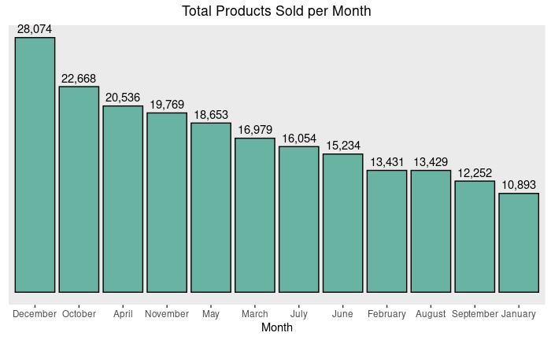
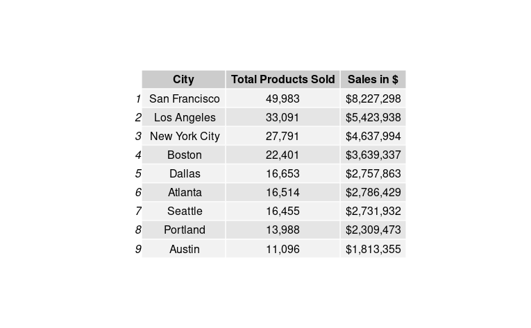

Sales Analysis
================
Brittny Huggins

## Context

Sales analysis is the process of integrating, analyzing, and
understanding various data related to sales activities such as sales,
customers, and transaction data. Understanding revenue-driving metrics
is important to the company because it allows for informed decisions to
be made about pricing and product development, sales strategies, target
markets, and much more.

## Data Contents

-   **Order ID** - An Order ID is the number system that Amazon uses
    exclusively to keep track of orders. Each order receives its own
    Order ID that will not be duplicated. This number can be useful to
    the seller when attempting to find out certain details about an
    order such as shipment date or status.
-   **Product** - The product that have been sold.
-   **Quantity Ordered** - Ordered Quantity is the total item quantity
    ordered in the initial order (without any changes).
-   **Price Each** - The price of each products.
-   **Order Date** - This is the date the customer is requesting the
    order be shipped.
-   **Purchase Address** - The purchase order is prepared by the buyer,
    often through a purchasing department. The purchase order, or PO,
    usually includes a PO number, which is useful in matching shipments
    with purchases; a shipping date; billing address; shipping address;
    and the request items, quantities and price.

## Objectives

-   What was the best month for sales? How much was earned that month?
-   What City had the highest number of sales?
-   What time should we display advertisement to maximize likelihood of
    customer’s buying product?
-   What product sold the most? Why do you think it sold the most?

#### What was the best month for sales and how much was earned that month?



December was the best month for sales where the number of products sold
reached 28,074. \$4,613,443 was earned in the month of December.

#### Which city had the highest number of sales?



The city of San Francisco had the highest number of sales.

#### What time should we display advertisement to maximize likelihood of customer’s buying product?

<div id="htmlwidget-07d6614d5c7210e8a585" style="width:672px;height:480px;" class="plotly html-widget"></div>
<script type="application/json" data-for="htmlwidget-07d6614d5c7210e8a585">{"x":{"data":[{"x":[1,2,3,4,5,6,7,8,9,10,11,12,13,14,15,16,17,18,19,20,21,22,23,24,24,24,23,22,21,20,19,18,17,16,15,14,13,12,11,10,9,8,7,6,5,4,3,2,1,1],"y":[0,0,0,0,0,0,0,0,0,0,0,0,0,0,0,0,0,0,0,0,0,0,0,0,0,8395,11039,13117,14211,14318,12754,11869,11286,11853,12779,14119,14090,13270,11070,8463,5638,3598,2085,1103,855,1058,1926,3363,5713,0],"text":["Time: 12:00:00 AM<br />Items.Sold:  5713","Time: 01:00:00 AM<br />Items.Sold:  3363","Time: 02:00:00 AM<br />Items.Sold:  1926","Time: 03:00:00 AM<br />Items.Sold:  1058","Time: 04:00:00 AM<br />Items.Sold:   855","Time: 05:00:00 AM<br />Items.Sold:  1103","Time: 06:00:00 AM<br />Items.Sold:  2085","Time: 07:00:00 AM<br />Items.Sold:  3598","Time: 08:00:00 AM<br />Items.Sold:  5638","Time: 09:00:00 AM<br />Items.Sold:  8463","Time: 10:00:00 AM<br />Items.Sold: 11070","Time: 11:00:00 AM<br />Items.Sold: 13270","Time: 12:00:00 PM<br />Items.Sold: 14090","Time: 01:00:00 PM<br />Items.Sold: 14119","Time: 02:00:00 PM<br />Items.Sold: 12779","Time: 03:00:00 PM<br />Items.Sold: 11853","Time: 04:00:00 PM<br />Items.Sold: 11286","Time: 05:00:00 PM<br />Items.Sold: 11869","Time: 06:00:00 PM<br />Items.Sold: 12754","Time: 07:00:00 PM<br />Items.Sold: 14318","Time: 08:00:00 PM<br />Items.Sold: 14211","Time: 09:00:00 PM<br />Items.Sold: 13117","Time: 10:00:00 PM<br />Items.Sold: 11039","Time: 11:00:00 PM<br />Items.Sold:  8395","Time: 11:00:00 PM<br />Items.Sold:  8395","Time: 11:00:00 PM<br />Items.Sold:  8395","Time: 10:00:00 PM<br />Items.Sold: 11039","Time: 09:00:00 PM<br />Items.Sold: 13117","Time: 08:00:00 PM<br />Items.Sold: 14211","Time: 07:00:00 PM<br />Items.Sold: 14318","Time: 06:00:00 PM<br />Items.Sold: 12754","Time: 05:00:00 PM<br />Items.Sold: 11869","Time: 04:00:00 PM<br />Items.Sold: 11286","Time: 03:00:00 PM<br />Items.Sold: 11853","Time: 02:00:00 PM<br />Items.Sold: 12779","Time: 01:00:00 PM<br />Items.Sold: 14119","Time: 12:00:00 PM<br />Items.Sold: 14090","Time: 11:00:00 AM<br />Items.Sold: 13270","Time: 10:00:00 AM<br />Items.Sold: 11070","Time: 09:00:00 AM<br />Items.Sold:  8463","Time: 08:00:00 AM<br />Items.Sold:  5638","Time: 07:00:00 AM<br />Items.Sold:  3598","Time: 06:00:00 AM<br />Items.Sold:  2085","Time: 05:00:00 AM<br />Items.Sold:  1103","Time: 04:00:00 AM<br />Items.Sold:   855","Time: 03:00:00 AM<br />Items.Sold:  1058","Time: 02:00:00 AM<br />Items.Sold:  1926","Time: 01:00:00 AM<br />Items.Sold:  3363","Time: 12:00:00 AM<br />Items.Sold:  5713","Time: 12:00:00 AM<br />Items.Sold:  5713"],"type":"scatter","mode":"lines","line":{"width":1.88976377952756,"color":"transparent","dash":"solid"},"fill":"toself","fillcolor":"rgba(105,179,162,0.5)","hoveron":"points","showlegend":false,"xaxis":"x","yaxis":"y","hoverinfo":"text","frame":null},{"x":[1,2,3,4,5,6,7,8,9,10,11,12,13,14,15,16,17,18,19,20,21,22,23,24],"y":[5713,3363,1926,1058,855,1103,2085,3598,5638,8463,11070,13270,14090,14119,12779,11853,11286,11869,12754,14318,14211,13117,11039,8395],"text":["Time: 12:00:00 AM<br />Items.Sold:  5713","Time: 01:00:00 AM<br />Items.Sold:  3363","Time: 02:00:00 AM<br />Items.Sold:  1926","Time: 03:00:00 AM<br />Items.Sold:  1058","Time: 04:00:00 AM<br />Items.Sold:   855","Time: 05:00:00 AM<br />Items.Sold:  1103","Time: 06:00:00 AM<br />Items.Sold:  2085","Time: 07:00:00 AM<br />Items.Sold:  3598","Time: 08:00:00 AM<br />Items.Sold:  5638","Time: 09:00:00 AM<br />Items.Sold:  8463","Time: 10:00:00 AM<br />Items.Sold: 11070","Time: 11:00:00 AM<br />Items.Sold: 13270","Time: 12:00:00 PM<br />Items.Sold: 14090","Time: 01:00:00 PM<br />Items.Sold: 14119","Time: 02:00:00 PM<br />Items.Sold: 12779","Time: 03:00:00 PM<br />Items.Sold: 11853","Time: 04:00:00 PM<br />Items.Sold: 11286","Time: 05:00:00 PM<br />Items.Sold: 11869","Time: 06:00:00 PM<br />Items.Sold: 12754","Time: 07:00:00 PM<br />Items.Sold: 14318","Time: 08:00:00 PM<br />Items.Sold: 14211","Time: 09:00:00 PM<br />Items.Sold: 13117","Time: 10:00:00 PM<br />Items.Sold: 11039","Time: 11:00:00 PM<br />Items.Sold:  8395"],"type":"scatter","mode":"lines","line":{"width":1.88976377952756,"color":"rgba(105,179,162,1)","dash":"solid"},"hoveron":"points","showlegend":false,"xaxis":"x","yaxis":"y","hoverinfo":"text","frame":null}],"layout":{"margin":{"t":95.7011207970112,"r":39.8505603985056,"b":59.609796596098,"l":93.8148609381486},"font":{"color":"rgba(0,0,0,1)","family":"Arial Narrow","size":15.2760481527605},"title":{"text":"<b> Total Items Sold per Hour <\/b>","font":{"color":"rgba(0,0,0,1)","family":"Arial Narrow","size":23.9103362391034},"x":0.5,"xref":"paper"},"xaxis":{"domain":[0,1],"automargin":true,"type":"linear","autorange":false,"range":[0.4,24.6],"tickmode":"array","ticktext":["12:00:00 AM","01:00:00 AM","02:00:00 AM","03:00:00 AM","04:00:00 AM","05:00:00 AM","06:00:00 AM","07:00:00 AM","08:00:00 AM","09:00:00 AM","10:00:00 AM","11:00:00 AM","12:00:00 PM","01:00:00 PM","02:00:00 PM","03:00:00 PM","04:00:00 PM","05:00:00 PM","06:00:00 PM","07:00:00 PM","08:00:00 PM","09:00:00 PM","10:00:00 PM","11:00:00 PM"],"tickvals":[1,2,3,4,5,6,7,8,9,10,11,12,13,14,15,16,17,18,19,20,21,22,23,24],"categoryorder":"array","categoryarray":["12:00:00 AM","01:00:00 AM","02:00:00 AM","03:00:00 AM","04:00:00 AM","05:00:00 AM","06:00:00 AM","07:00:00 AM","08:00:00 AM","09:00:00 AM","10:00:00 AM","11:00:00 AM","12:00:00 PM","01:00:00 PM","02:00:00 PM","03:00:00 PM","04:00:00 PM","05:00:00 PM","06:00:00 PM","07:00:00 PM","08:00:00 PM","09:00:00 PM","10:00:00 PM","11:00:00 PM"],"nticks":null,"ticks":"","tickcolor":null,"ticklen":3.81901203819012,"tickwidth":0,"showticklabels":false,"tickfont":{"color":null,"family":null,"size":0},"tickangle":-0,"showline":false,"linecolor":null,"linewidth":0,"showgrid":false,"gridcolor":null,"gridwidth":0,"zeroline":false,"anchor":"y","title":{"text":"","font":{"color":"rgba(0,0,0,1)","family":"Arial Narrow","size":11.9551681195517}},"hoverformat":".2f"},"yaxis":{"domain":[0,1],"automargin":true,"type":"linear","autorange":false,"range":[-715.9,15033.9],"tickmode":"array","ticktext":["0","5000","10000","15000"],"tickvals":[0,5000,10000,15000],"categoryorder":"array","categoryarray":["0","5000","10000","15000"],"nticks":null,"ticks":"","tickcolor":null,"ticklen":3.81901203819012,"tickwidth":0,"showticklabels":true,"tickfont":{"color":"rgba(77,77,77,1)","family":"Arial Narrow","size":15.2760481527605},"tickangle":-0,"showline":false,"linecolor":null,"linewidth":0,"showgrid":true,"gridcolor":"rgba(247,247,247,1)","gridwidth":0.132835201328352,"zeroline":false,"anchor":"x","title":{"text":"Items Sold","font":{"color":"rgba(0,0,0,1)","family":"Arial Narrow","size":11.9551681195517}},"hoverformat":".2f"},"shapes":[{"type":"rect","fillcolor":null,"line":{"color":null,"width":0,"linetype":[]},"yref":"paper","xref":"paper","x0":0,"x1":1,"y0":0,"y1":1}],"showlegend":false,"legend":{"bgcolor":null,"bordercolor":null,"borderwidth":0,"font":{"color":"rgba(0,0,0,1)","family":"Arial Narrow","size":12.2208385222084}},"hovermode":"closest","barmode":"relative"},"config":{"doubleClick":"reset","modeBarButtonsToAdd":["hoverclosest","hovercompare"],"showSendToCloud":false},"source":"A","attrs":{"1f3d6714c45f":{"x":{},"y":{},"type":"scatter"},"1f3d3fc05e66":{"x":{},"y":{}}},"cur_data":"1f3d6714c45f","visdat":{"1f3d6714c45f":["function (y) ","x"],"1f3d3fc05e66":["function (y) ","x"]},"highlight":{"on":"plotly_click","persistent":false,"dynamic":false,"selectize":false,"opacityDim":0.2,"selected":{"opacity":1},"debounce":0},"shinyEvents":["plotly_hover","plotly_click","plotly_selected","plotly_relayout","plotly_brushed","plotly_brushing","plotly_clickannotation","plotly_doubleclick","plotly_deselect","plotly_afterplot","plotly_sunburstclick"],"base_url":"https://plot.ly"},"evals":[],"jsHooks":[]}</script>
<iframe src="/cloud/project/index.html" width="100%" height="600" scrolling="no" seamless="seamless" frameBorder="0"></iframe>

The company should display ads between the hours of **10 AM and 11 AM**
as well as **4 PM and 5 PM**. This is because these are the hours before
peak sale times for products.

#### What product sold the most? Why do you think it sold the most?

| Product                  | Amount Sold |
|:-------------------------|:------------|
| USB-C Charging Cable     | 21,772      |
| Lightning Charging Cable | 21,535      |
| AAA Batteries (4-pack)   | 20,529      |
| AA Batteries (4-pack)    | 20,461      |
| Wired Headphones         | 18,787      |

From the table above it shows that the USB-C charging cable sold the
most. I believe it sold the most because it is an accessory to a main
product like a Google phone or the Bose sound sport headphones. The top
five items sold are accessories needed for other products that customers
may have purchased.

## Technical Annex

``` r
#Data importation and Preprocessing

#Data importation and combining all data tables 
jan <- read.csv("Sales_January_2019.csv")
 feb <- read.csv("Sales_February_2019.csv")
 march <- read.csv("Sales_March_2019.csv")
 april <- read.csv("Sales_April_2019.csv")
 may <- read.csv("Sales_May_2019.csv")
 june <- read.csv("Sales_June_2019.csv")
 july <- read.csv("Sales_July_2019.csv")
 aug <- read.csv("Sales_August_2019.csv")
 sept <- read.csv("Sales_September_2019.csv")
 oct <- read.csv("Sales_October_2019.csv")
 nov <- read.csv("Sales_November_2019.csv")
 dec <- read.csv("Sales_December_2019.csv")
 
 #Removing rows containing wrong values 
jan <- jan %>% filter(Order.ID != "Order ID")
feb <- feb %>% filter(Order.ID != "Order ID")
 march <- march %>% filter(Order.ID != "Order ID")
 april <- april %>% filter(Order.ID != "Order ID")
 may <- may %>% filter(Order.ID != "Order ID")
 june <-june %>% filter(Order.ID != "Order ID")
 july <- july %>% filter(Order.ID != "Order ID")
 aug <- aug %>% filter(Order.ID != "Order ID")
 sept <- sept %>% filter(Order.ID != "Order ID")
 oct <- oct %>% filter(Order.ID != "Order ID")
 nov <- nov %>% filter(Order.ID != "Order ID")
 dec <- dec %>% filter(Order.ID != "Order ID")


 df <- do.call("rbind", list(jan,feb,march,april,may,june,july,aug,sept,oct,nov,dec))

 
 
 #checks for duplicated values
which(duplicated(df))

#removes those values 
df_no_dup <- df[!duplicated(df),]


#check for missing values 
sum(is.na(df_no_dup))

# After removing duplicates and checking for missing values we are left with 184,954 rows of data.

#Converting and adding columns

df <- df_no_dup

#Convert Date column 
df$Order.Date<- as.POSIXct(df$Order.Date,format="%m/%d/%Y %H:%M")

# Convert Quantity Ordered Column 
df$Quantity.Ordered <- as.numeric(df$Quantity.Ordered)

#Add month name column 
df$month <- format(df$Order.Date,"%B")

#Convert Order.Date to standard time with am/pm 
df$datehour <- format(df$Order.Date, "%Y-%m-%d %I:%M:%S %p")
df$datehour <- as.POSIXct(df$datehour)

#Separate Datehour column for further analysis 
df[c("new_date", "time", "ap")] <- stringr::str_split_fixed(df$datehour, ' ', 3)

#Split address column into separate columns
df[c("Address", "City", "State")] <- str_split_fixed(df$Purchase.Address, ',', 3)

#Convert Price.Each column 
df$Price.Each <- as.numeric(df$Price.Each)

# Adds earnings column to data frame
df$Sales.Totals.Price <- (df$Quantity.Ordered*df$Price.Each)


## Analysis 
# Best Month

mon_sales <- df %>% group_by(month) %>% dplyr::summarise(Total.Products.Sold = sum(Quantity.Ordered)) %>% arrange(desc(Total.Products.Sold))

mon_sales <- mon_sales %>% filter(month != "NA")


ggplot(data=mon_sales, aes(x = reorder(month, -Total.Products.Sold), y = Total.Products.Sold)) + geom_text(aes(label = format(Total.Products.Sold,big.mark = ",", scientific = FALSE)), vjust = -.5, position = position_dodge(width = 1))+ 
geom_bar(colour="black", stat="identity", fill = "#69b3a2", position = position_dodge()) + xlab("Month") + ggtitle("Total Products Sold per Month") + theme(plot.title = element_text(hjust = 0.5), axis.text.y =element_blank(), axis.ticks.y=element_blank(), axis.title.y = element_blank(), panel.border = element_blank(), panel.grid.major = element_blank(),
panel.grid.minor = element_blank())


#City with highest sales 

#highest total product sold 
city_sales <- df %>%
     group_by(City) %>%
     dplyr::summarise(Products.Sold = sum(Quantity.Ordered)) %>% 
     arrange(desc(Products.Sold))

city_sales <- city_sales %>% filter(Products.Sold != "NA")

#Sales in dollars 
dol_sales <- df %>% group_by(City) %>% dplyr::summarise(Product.Sales = sum(Sales.Totals.Price))

dol_sales <- dol_sales %>% filter(Product.Sales != "NA")

#join tables
city_sales <- merge(x=city_sales,y=dol_sales,by = "City")

city_sales <- city_sales %>% arrange(desc(Products.Sold))

#format 
city_sales$Products.Sold <- format(city_sales$Products.Sold, big.mark = ",", scientific = FALSE)

city_sales$Product.Sales <- dollar(city_sales$Product.Sales)
  
colnames(city_sales) <- c("City", "Total Products Sold", "Sales in $")


grid.table(city_sales)


# Best times to display ads

df$rtime <- round_date(df$Order.Date,unit="hour")

df$rtime <- format(df$rtime,"%I:%M:%S %p")

df[c("New_time", "ap")] <- str_split_fixed(df$rtime, ' ', 2)

inall <-df[,c("New_time","ap", "Quantity.Ordered")]

cmb<- factor(c("12:00:00 AM", "01:00:00 AM" , "02:00:00 AM", "03:00:00 AM","04:00:00 AM","05:00:00 AM" ,"06:00:00 AM" ,"07:00:00 AM","08:00:00 AM","09:00:00 AM","10:00:00 AM","11:00:00 AM","12:00:00 PM","01:00:00 PM","02:00:00 PM","03:00:00 PM","04:00:00 PM","05:00:00 PM","06:00:00 PM" ,"07:00:00 PM" ,"08:00:00 PM","09:00:00 PM","10:00:00 PM","11:00:00 PM" ))

inall$combined <- paste(inall$New_time, inall$ap)

total.items.tt <- inall %>%
    group_by(combined) %>%
    dplyr::summarise(Items.Sold = sum(Quantity.Ordered))

total.items.tt<- total.items.tt %>% filter(Items.Sold != "NA")


total.items.tt$Time <- factor(total.items.tt$combined, levels = cmb)


items.tt <- total.items.tt[order(total.items.tt$Time),]

p <- items.tt %>%
    ggplot(aes(x=Time, y=Items.Sold, group = 1)) +
    geom_area(fill="#69b3a2", alpha=0.5) +
    geom_line(color="#69b3a2") +
    ylab("Items Sold") +
    xlab(NULL) + 
    theme_ipsum() +
    theme(axis.text.x=element_blank(),
    panel.grid.major.x = element_blank() ,
    panel.grid.major.y = element_line( size=.1, color="gray97") ,
    plot.title = element_text(hjust = 0.5)
    ) +
    ggtitle("Total Items Sold per Hour") 
    

                  
p <- ggplotly(p)

p


# Most sold product 

Most_Sold <- df %>% group_by(Product) %>% dplyr::count( Product)
Most_Sold <- Most_Sold%>% arrange(desc(n)) %>% head(5)
Most_Sold$n <-  format(Most_Sold$n, big.mark = ",", scientific = FALSE)
colnames(Most_Sold)[2] <- "Amount Sold"

knitr::kable(Most_Sold)
```
