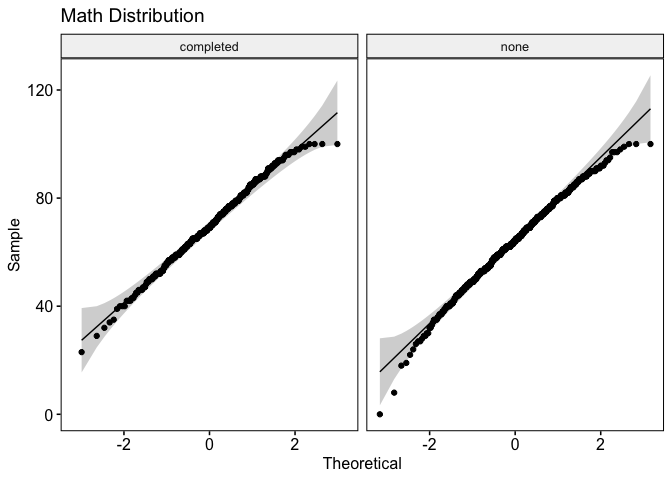

What Influences Students Exam Grades?
================
Brittny Huggins
12/29/2021

## Introduction

I’ve received a cleaned data set containing the following information
about students:

-   Gender
-   Race/ethnicity
-   Parental level of education
-   Lunch type
-   Attendance to a test prep course
-   math, reading, and writing scores from exams

This information can be used to see if other factors influence student
performance, and if they do what could be implemented to make sure
students are performing to the best of their ability. In particular id
like to see if gender, attendance to test preparation, and
race/ethnicity play a role in student performance.

link to data set:[Student
Performance](https://www.kaggle.com/spscientist/students-performance-in-exams)

## Install Packages and Import data

``` r
options(repos = list(CRAN="http://cran.rstudio.com/"))
install.packages("tidyverse")
```

    ## 
    ## The downloaded binary packages are in
    ##  /var/folders/p_/n9dk52q92ld5svrw21rdqf7w0000gn/T//RtmpoIDzPQ/downloaded_packages

``` r
install.packages("rstatix")
```

    ## 
    ## The downloaded binary packages are in
    ##  /var/folders/p_/n9dk52q92ld5svrw21rdqf7w0000gn/T//RtmpoIDzPQ/downloaded_packages

``` r
install.packages("ggpubr")
```

    ## 
    ## The downloaded binary packages are in
    ##  /var/folders/p_/n9dk52q92ld5svrw21rdqf7w0000gn/T//RtmpoIDzPQ/downloaded_packages

``` r
install.packages("cowplot")
```

    ## 
    ## The downloaded binary packages are in
    ##  /var/folders/p_/n9dk52q92ld5svrw21rdqf7w0000gn/T//RtmpoIDzPQ/downloaded_packages

``` r
library(tidyverse)
library(rstatix)
library(ggpubr)
library(cowplot)
library(scales)
library(gridExtra)
```

``` r
students <- read.csv("StudentsPerformance.csv")
```

## Gender

First, Lets see if gender plays a role in student performance.

``` r
#view the proportion of students by gender  

students %>%
  group_by(gender) %>% 
  count()
```

    ## # A tibble: 2 × 2
    ## # Groups:   gender [2]
    ##   gender     n
    ##   <chr>  <int>
    ## 1 female   518
    ## 2 male     482

``` r
#chart
totalstudents <- students %>% 
  group_by(gender)%>% 
  count() %>% 
  ungroup() %>%
  mutate(perc= `n` / sum(`n`)) %>% 
  arrange(perc) %>% #creates percentage
  mutate(labels= scales::percent(perc)) #new column of percentages

ggplot(totalstudents, aes(x = "", y = perc, fill = gender)) + 
  geom_col() +
  geom_label(aes(label = labels),
             position = position_stack(vjust = 0.5),
             show.legend = FALSE) +
  coord_polar(theta = "y") +
  theme_void() +
  labs(title= "Percentage of Students by Gender")
```

<!-- -->

– Out of 1,000 student scores there are a total of 518 females making up
51.8% of the student body, and there are 482 males making up 48.2% of
the student body.

Now that we have viewed the total number of students by gender lets view
their average scores for each exam as well as compare their scores on
box plots.

    ## # A tibble: 2 × 5
    ##   gender variable       n  mean    sd
    ##   <chr>  <chr>      <dbl> <dbl> <dbl>
    ## 1 female math.score   518  63.6  15.5
    ## 2 male   math.score   482  68.7  14.4

    ## # A tibble: 2 × 5
    ##   gender variable          n  mean    sd
    ##   <chr>  <chr>         <dbl> <dbl> <dbl>
    ## 1 female reading.score   518  72.6  14.4
    ## 2 male   reading.score   482  65.5  13.9

    ## # A tibble: 2 × 5
    ##   gender variable          n  mean    sd
    ##   <chr>  <chr>         <dbl> <dbl> <dbl>
    ## 1 female writing.score   518  72.5  14.8
    ## 2 male   writing.score   482  63.3  14.1

``` r
#create box plots 

MathBP <- ggplot(students, aes(y=math.score, fill= gender)) +
  geom_boxplot() + 
  ylab("Math Score") +
  ggtitle("Math Scores") + 
  theme(legend.position = "none")

ReadBP <- ggplot(students, aes(y=reading.score, fill= gender)) +
  geom_boxplot() + 
  ylab("Reading Score") +
  ggtitle("Reading Scores") + 
  theme(legend.position = "none")

WriteBP <- ggplot(students, aes(y=writing.score, fill= gender)) + geom_boxplot()+ ylab("Writing Score")+ ggtitle("Writing Scores")

 grid.arrange(MathBP, 
              ReadBP, 
              WriteBP,
              nrow= 2)
```

<!-- -->

From the plots you can visually see that males score higher in math
while females score higher in reading and writing.

**Averages**

**Math**

-   Males:68.7 and females:63.6

**Reading**

-   Males:65.5 and females:72.6

**Writing**

-   Males: 63.3 and female:72.5

To see if gender actually plays a role in the difference of average
scores then a t-test needs to be run. A t-test is a parametric test used
to compare the means of two groups. A t-test assumes that:

        * Independent groups
        * No extreme outliers 
        * Homogeneity of variance(groups have similar variance)
        * (approximately) Normally distributed

The groups are independent of each other (male and female), but lets
make sure that the data is has no extreme outliers, is normally
distributed, and has similar variance.

    ## # A tibble: 8 × 4
    ##   gender math.score is.outlier is.extreme
    ##   <chr>       <int> <lgl>      <lgl>     
    ## 1 female         18 TRUE       FALSE     
    ## 2 female          0 TRUE       FALSE     
    ## 3 female         22 TRUE       FALSE     
    ## 4 female         19 TRUE       FALSE     
    ## 5 female         23 TRUE       FALSE     
    ## 6 female          8 TRUE       FALSE     
    ## 7 male           27 TRUE       FALSE     
    ## 8 male           28 TRUE       FALSE

    ## # A tibble: 8 × 4
    ##   gender reading.score is.outlier is.extreme
    ##   <chr>          <int> <lgl>      <lgl>     
    ## 1 female            32 TRUE       FALSE     
    ## 2 female            17 TRUE       FALSE     
    ## 3 female            31 TRUE       FALSE     
    ## 4 female            29 TRUE       FALSE     
    ## 5 female            24 TRUE       FALSE     
    ## 6 male              26 TRUE       FALSE     
    ## 7 male              23 TRUE       FALSE     
    ## 8 male              24 TRUE       FALSE

    ## # A tibble: 12 × 4
    ##    gender writing.score is.outlier is.extreme
    ##    <chr>          <int> <lgl>      <lgl>     
    ##  1 female            28 TRUE       FALSE     
    ##  2 female            10 TRUE       FALSE     
    ##  3 female            33 TRUE       FALSE     
    ##  4 female            27 TRUE       FALSE     
    ##  5 female            32 TRUE       FALSE     
    ##  6 female            33 TRUE       FALSE     
    ##  7 female            30 TRUE       FALSE     
    ##  8 female            32 TRUE       FALSE     
    ##  9 female            36 TRUE       FALSE     
    ## 10 female            23 TRUE       FALSE     
    ## 11 male              19 TRUE       FALSE     
    ## 12 male              15 TRUE       FALSE

— From the box plots you can see that there are some outliers but the
identify_outliers function lets us see if these outliers are severe
enough to sway our data and I found that none of the outliers were
extreme.

<!-- --><!-- --><!-- -->

— Next, by using a QQ plot distribution can be determined. Since most of
the points fall along the line then it can assumed that this data is
normally distributed. Now, lets look for similar variance.

    ## # A tibble: 1 × 4
    ##     df1   df2 statistic     p
    ##   <int> <int>     <dbl> <dbl>
    ## 1     1   998     0.346 0.556

    ## # A tibble: 1 × 4
    ##     df1   df2 statistic     p
    ##   <int> <int>     <dbl> <dbl>
    ## 1     1   998    0.0188 0.891

    ## # A tibble: 1 × 4
    ##     df1   df2 statistic     p
    ##   <int> <int>     <dbl> <dbl>
    ## 1     1   998   0.00694 0.934

— Finally, I used the levene_test function to check for similar variance
and I found that there was similar variance throughout each group
because the calculated p-value is greater than the alpha level of 0.05.
Now that the criteria is fulfilled, the t-test can be done.

``` r
math_t_stats <- students %>% t_test(math.score ~ gender, var.equal = TRUE) %>% add_significance()

reading_t_stats <- students %>% t_test(reading.score ~ gender, var.equal = TRUE) %>% add_significance()

writing_t_stats <- students %>% t_test(writing.score ~ gender, var.equal = TRUE) %>% add_significance()
```

**Findings**

**Math**

-   The average score for the females was 63.6 (SD = 15.5), whereas the
    mean in male group was 68.7 (SD = 14.4). An independent student
    t-test showed that the difference was statistically significant,
    t(998) = -5.38 , p \< 0.0001.

**Reading**

-   The average score for the females was 72.6 (SD = 14.4), whereas the
    mean in male group was 65.5 (SD = 13.9). An independent student
    t-test showed that the difference was statistically significant,
    t(998) = 7.96 , p \< 0.0001.

**Writing**

-   The average score for the females was 72.5 (SD = 14.8), whereas the
    mean in male group was 63.3 (SD = 14.1). An independent student
    t-test showed that the difference was statistically significant,
    t(998) = 9.98 , p \< 0.0001.

(alpha = 0.05)

The average score for each exam type is statistically different between
males and females, but even though they are different that doesn’t mean
that there is a huge effect size. In simpler terms yes there maybe a
statistical difference, but that difference maybe so small that it is
not a huge cause for concern. We can find this out by finding the
Cohen’s D which measures how big the difference is between the groups.

    ## # A tibble: 1 × 7
    ##   .y.        group1 group2 effsize    n1    n2 magnitude
    ## * <chr>      <chr>  <chr>    <dbl> <int> <int> <ord>    
    ## 1 math.score female male    -0.341   518   482 small

    ## # A tibble: 1 × 7
    ##   .y.           group1 group2 effsize    n1    n2 magnitude
    ## * <chr>         <chr>  <chr>    <dbl> <int> <int> <ord>    
    ## 1 reading.score female male     0.504   518   482 moderate

    ## # A tibble: 1 × 7
    ##   .y.           group1 group2 effsize    n1    n2 magnitude
    ## * <chr>         <chr>  <chr>    <dbl> <int> <int> <ord>    
    ## 1 writing.score female male     0.632   518   482 moderate

**Math**

-   The effect size of the difference between the average math scores of
    females and males is -0.341 ,a small effect size. This means that
    the average female scores -0.341 standard deviations below the
    average male score.

**Reading**

-   The effect size of the difference between the average reading scores
    of females and males is 0.504 , a moderate effect size. This means
    that the average female scores 0.504 standard deviations above the
    average male score.

**Writing**

-   The effect size of the difference between the average writing scores
    of females and males is 0.632, a moderate effect size. This means
    that the average female scores 0.632 standard deviations above the
    average male score.

## Test Prep Course

Next, I will run another t-test for those who have taken the test
preparation course and those who have not. I will be going through the
same steps as the above t-test.

    ## # A tibble: 2 × 5
    ##   test.preparation.course variable       n  mean    sd
    ##   <chr>                   <chr>      <dbl> <dbl> <dbl>
    ## 1 completed               math.score   358  69.7  14.4
    ## 2 none                    math.score   642  64.1  15.2

    ## # A tibble: 2 × 5
    ##   test.preparation.course variable          n  mean    sd
    ##   <chr>                   <chr>         <dbl> <dbl> <dbl>
    ## 1 completed               reading.score   358  73.9  13.6
    ## 2 none                    reading.score   642  66.5  14.5

    ## # A tibble: 2 × 5
    ##   test.preparation.course variable          n  mean    sd
    ##   <chr>                   <chr>         <dbl> <dbl> <dbl>
    ## 1 completed               writing.score   358  74.4  13.4
    ## 2 none                    writing.score   642  64.5  15

``` r
#create box plots 

MathBPtest <- ggplot(students, aes(y=math.score, fill= test.preparation.course)) +
  geom_boxplot() + 
  ylab("Math Score") +
  ggtitle("Math Scores") + 
  theme(legend.position = "none")

ReadBPtest <- ggplot(students, aes(y=reading.score, fill= test.preparation.course)) +
  geom_boxplot() + 
  ylab("Reading Score") +
  ggtitle("Reading Scores") + 
  theme(legend.position = "none")

WriteBPtest <- ggplot(students, aes(y=writing.score, fill= test.preparation.course)) + geom_boxplot()+ ylab("Writing Score")+ ggtitle("Writing Scores")

 grid.arrange(MathBPtest, 
              ReadBPtest, 
              WriteBPtest,
              nrow= 2)
```

<!-- -->

— From just viewing the box plots you can see that those who have
completed the course had higher average scores than those that didn’t
completed the course. The average score of those who did complete the
course are as follows: math: 69.7, reading: 73.9, writing: 74.4. The
average scores of those who did not complete the course are: math:64.1,
reading: 66.5, and writing: 64.5.

Now, I’ll go through the t-test process.

``` r
#Identify outliers 
```

    ## # A tibble: 7 × 4
    ##   test.preparation.course math.score is.outlier is.extreme
    ##   <chr>                        <int> <lgl>      <lgl>     
    ## 1 completed                       29 TRUE       FALSE     
    ## 2 completed                       23 TRUE       FALSE     
    ## 3 none                            18 TRUE       FALSE     
    ## 4 none                             0 TRUE       FALSE     
    ## 5 none                            22 TRUE       FALSE     
    ## 6 none                            19 TRUE       FALSE     
    ## 7 none                             8 TRUE       FALSE

    ## # A tibble: 6 × 4
    ##   test.preparation.course reading.score is.outlier is.extreme
    ##   <chr>                           <int> <lgl>      <lgl>     
    ## 1 none                               17 TRUE       FALSE     
    ## 2 none                               26 TRUE       FALSE     
    ## 3 none                               28 TRUE       FALSE     
    ## 4 none                               23 TRUE       FALSE     
    ## 5 none                               24 TRUE       FALSE     
    ## 6 none                               24 TRUE       FALSE

    ## # A tibble: 8 × 4
    ##   test.preparation.course writing.score is.outlier is.extreme
    ##   <chr>                           <int> <lgl>      <lgl>     
    ## 1 completed                          40 TRUE       FALSE     
    ## 2 completed                          36 TRUE       FALSE     
    ## 3 completed                          38 TRUE       FALSE     
    ## 4 none                               10 TRUE       FALSE     
    ## 5 none                               22 TRUE       FALSE     
    ## 6 none                               19 TRUE       FALSE     
    ## 7 none                               15 TRUE       FALSE     
    ## 8 none                               23 TRUE       FALSE

— There were no extreme outliers.

<!-- --><!-- --><!-- -->

— All are normally distributed.

    ## # A tibble: 1 × 4
    ##     df1   df2 statistic     p
    ##   <int> <int>     <dbl> <dbl>
    ## 1     1   998     0.533 0.466

    ## # A tibble: 1 × 4
    ##     df1   df2 statistic     p
    ##   <int> <int>     <dbl> <dbl>
    ## 1     1   998      1.08 0.299

    ## # A tibble: 1 × 4
    ##     df1   df2 statistic      p
    ##   <int> <int>     <dbl>  <dbl>
    ## 1     1   998      5.97 0.0147

— The math and reading groups have similar variance so we will use the
same independent student t-test for those, but there doesn’t seem to be
an equal variance for writing exam so we’ll have to use a Welch’s t-test
for that.

``` r
math_t_stats_test <- students %>% t_test(math.score ~ test.preparation.course, var.equal = TRUE) %>% add_significance()

reading_t_stats_test <- students %>% t_test(reading.score ~ test.preparation.course, var.equal = TRUE) %>% add_significance()

writing_t_stats_test <- students %>% t_test(writing.score ~ test.preparation.course) %>% add_significance() 


#Cohen's D 


students %>%  cohens_d(math.score ~ test.preparation.course, var.equal = TRUE)
```

    ## # A tibble: 1 × 7
    ##   .y.        group1    group2 effsize    n1    n2 magnitude
    ## * <chr>      <chr>     <chr>    <dbl> <int> <int> <ord>    
    ## 1 math.score completed none     0.376   358   642 small

``` r
students %>%  cohens_d(reading.score ~ test.preparation.course, var.equal = TRUE)
```

    ## # A tibble: 1 × 7
    ##   .y.           group1    group2 effsize    n1    n2 magnitude
    ## * <chr>         <chr>     <chr>    <dbl> <int> <int> <ord>    
    ## 1 reading.score completed none     0.519   358   642 moderate

``` r
students %>%  cohens_d(writing.score ~ test.preparation.course, var.equal = FALSE)
```

    ## # A tibble: 1 × 7
    ##   .y.           group1    group2 effsize    n1    n2 magnitude
    ## * <chr>         <chr>     <chr>    <dbl> <int> <int> <ord>    
    ## 1 writing.score completed none     0.698   358   642 moderate

**Findings**

**Math**

-   The average score for those who completed the course is 69.7 (SD =
    14.4), whereas the mean in no test prep(none) group was 64.1 (SD =
    15.2). An independent student t-test showed that the difference was
    statistically significant, t(998) = 5.70 , p \< 0.0001, d= 0.376/
    small.

**Reading**

-   The average score for those who completed the course is 73.9 (SD =
    13.6), whereas the mean in no test prep(none) group was 66.5 (SD =
    14.5). An independent student t-test showed that the difference was
    statistically significant, t(998) = 7.87 , p \< 0.0001, d= 0.519/
    moderate.

**Writing**

-   The average score for those who completed the course is 74.4 (SD =
    13.4), whereas the mean in no test prep(none) group was 64.5 (SD =
    15). An independent student t-test showed that the difference was
    statistically significant, t(811) = 10.75 , p \< 0.0001, d= 0.698/
    moderate.

## Race/Ethnicity

Finally, lets analyze race/ethnicity to see if it may influence student
scores. There are 5 different race/ethnicity groups: A,B,C,D, and E.
Lets first visualize the data on box plots and get some summary
statistics.

    ## # A tibble: 5 × 5
    ##   race.ethnicity variable       n  mean    sd
    ##   <chr>          <chr>      <dbl> <dbl> <dbl>
    ## 1 group A        math.score    89  61.6  14.5
    ## 2 group B        math.score   190  63.5  15.5
    ## 3 group C        math.score   319  64.5  14.9
    ## 4 group D        math.score   262  67.4  13.8
    ## 5 group E        math.score   140  73.8  15.5

    ## # A tibble: 5 × 5
    ##   race.ethnicity variable          n  mean    sd
    ##   <chr>          <chr>         <dbl> <dbl> <dbl>
    ## 1 group A        reading.score    89  64.7  15.5
    ## 2 group B        reading.score   190  67.4  15.2
    ## 3 group C        reading.score   319  69.1  14.0
    ## 4 group D        reading.score   262  70.0  13.9
    ## 5 group E        reading.score   140  73.0  14.9

    ## # A tibble: 5 × 5
    ##   race.ethnicity variable          n  mean    sd
    ##   <chr>          <chr>         <dbl> <dbl> <dbl>
    ## 1 group A        writing.score    89  62.7  15.5
    ## 2 group B        writing.score   190  65.6  15.6
    ## 3 group C        writing.score   319  67.8  15.0
    ## 4 group D        writing.score   262  70.1  14.4
    ## 5 group E        writing.score   140  71.4  15.1

``` r
#Create boxplots 
math_raceBP <- ggplot(students, aes(y=math.score, fill= race.ethnicity))+  geom_boxplot() + ylab("Math Score")+ ggtitle("Math Scores") + theme(legend.position = "none")

read_raceBP <- ggplot(students, aes(y=reading.score, fill= race.ethnicity))+  geom_boxplot() + ylab("Reading Score")+ ggtitle("Reading Scores") + theme(legend.position = "none")

write_raceBP <-  ggplot(students, aes(y=writing.score, fill= race.ethnicity))+  geom_boxplot() + ylab("Writing Score")+ ggtitle("Writing Scores")

top_row <- grid.arrange(math_raceBP,
             read_raceBP,
             nrow= 1)

plot_grid(top_row, write_raceBP, nrow = 2)
```

<!-- -->

From just looking at the box plots you can see that groups’ performance
for each exam differs. Also if you look at the summary statistics you
can see the actual mean differences. It can’t just be decided that there
are statistically significant differences just by using the eyes. So
another test needs to be performed, but this time it will be an ANOVA
test since there are more than two sample groups.

To perform an ANOVA test, the data must be as follows:

        * Independent groups
        * Normally distributed
        * Homogeneity of variance 

The groups are independent of each other. So, lets see if our data meets
the other requirements.

<!-- --><!-- --><!-- -->

— All the groups seem to be normally distributed for each of the exams

    ## # A tibble: 1 × 4
    ##     df1   df2 statistic     p
    ##   <int> <int>     <dbl> <dbl>
    ## 1     4   995     0.590 0.670

    ## # A tibble: 1 × 4
    ##     df1   df2 statistic     p
    ##   <int> <int>     <dbl> <dbl>
    ## 1     4   995     0.919 0.452

    ## # A tibble: 1 × 4
    ##     df1   df2 statistic     p
    ##   <int> <int>     <dbl> <dbl>
    ## 1     4   995     0.478 0.752

— There is similar variance among all groups.

Our data meets the requirements so now we can jump into the ANOVA test.

``` r
#Replace names so they can fit on plot 

New_students <- students %>% mutate(group = case_when(race.ethnicity == "group A"  ~ "A",
                                      race.ethnicity == "group B"   ~ "B",
                                      race.ethnicity == "group C"   ~ "C", 
                                      race.ethnicity == "group D"   ~ "D",
                                      race.ethnicity == "group E"   ~ "E"))


math_anova <- aov(math.score ~ group, data = New_students)

reading_anova <- aov(reading.score ~ group, data = New_students)

writing_anova <- aov(writing.score ~ group, data = New_students)

summary(math_anova)
```

    ##              Df Sum Sq Mean Sq F value   Pr(>F)    
    ## group         4  12729    3182   14.59 1.37e-11 ***
    ## Residuals   995 216960     218                     
    ## ---
    ## Signif. codes:  0 '***' 0.001 '**' 0.01 '*' 0.05 '.' 0.1 ' ' 1

``` r
summary(reading_anova)
```

    ##              Df Sum Sq Mean Sq F value   Pr(>F)    
    ## group         4   4706  1176.6   5.622 0.000178 ***
    ## Residuals   995 208246   209.3                     
    ## ---
    ## Signif. codes:  0 '***' 0.001 '**' 0.01 '*' 0.05 '.' 0.1 ' ' 1

``` r
summary(writing_anova)
```

    ##              Df Sum Sq Mean Sq F value  Pr(>F)    
    ## group         4   6456  1614.0   7.162 1.1e-05 ***
    ## Residuals   995 224221   225.3                    
    ## ---
    ## Signif. codes:  0 '***' 0.001 '**' 0.01 '*' 0.05 '.' 0.1 ' ' 1

**ANOVA Results**

-   Math ANOVA: F(4,995) = 14.59, p \< 0.001

-   Reading ANOVA: F(4,995) = 5.62, p \< 0.001

-   Writing ANOVA: F(4,995) = 7.16, p \< 0.001

(alpha = 0.05)

For every ANOVA test the p-value is \< 0.001 meaning that there is
significant difference of scores in at least two of the groups for each
type of exam. In order to figure out the difference I’ll run a Tukey HSD
test and plot the results.

``` r
#Math 
plot(TukeyMath, las= 1) 
```

<!-- -->

``` r
#Reading
plot(TukeyRead, las= 1)
```

<!-- -->

``` r
#Writing
plot(TukeyWrite, las = 1)
```

<!-- -->

The test shows a number of combinations of groups compared to another
group to find/show if there is a difference. I wont report the exact
differences, but here are the following groups that have a significant
difference between scores:

**Math**

-   Groups D-A, E-A, D-B, E-B, E-C, E-D all have a significant
    difference in scores between them.

**Reading**

-   Groups D-A, E-A, and E-B all have a significant difference in scores
    between them.

**Writing**

-   Groups C-A, D-A, E-A, D-B, E-B all have a significant difference in
    scores between them.

## Conclusions

**Gender**

There is a significant difference between average scores of male and
female students. The difference is trivial for math so we can most
likely disregard that, but as for reading and writing the effect size
was moderate. Researchers from [the American Psychological
Association](https://www.apa.org/pubs/journals/releases/amp-amp0000356.pdf)
analyzed three decades of reading and writing scores among males and
females and found that females generally outperform males in reading and
writing test. They found this to be the case among primary and high
school students. There were a number of reasons why this could be the
case so this isn’t an issue that needs to be handled by the school
because it seems to be quite natural.

**Test Preparation Course**

As for the test preparation course there was a significant difference in
scores between those who took it and those that didn’t. The effect size
was trivial for math so it seems those who took the course and those who
didn’t scores didn’t really differ that much. As for reading and writing
the effect size was moderate so the school needs to be urging students
to take the test prep course by making flyers with the difference in
scores. Also those who fail one reading or writing exam should
automatically be assigned to test prep to increase their chances of
getting a higher score. In all cases though the test preparation course
is overall beneficial.

**Race/Ethnicity**

There were significant differences between racial groups. Group A is the
lowest performing group in math, reading, and writing. Of course the
school can’t split students up by race for studying because I’m sure
that would be a lawsuit, but like how colleges have groups like Latinos
in law or African Americans for Change. The school could try to have
after school study groups like that. Anyone would be able to join, but
it would be geared towards those of that certain ethnicity group. To not
seem prejudice or racist the school should show the statistics of the
group scores as well as forming groups for all the different races and
ethnicities. The groups could be a combination of studying as well as
sharing ethnic cultural and more. This is also not a taboo move, in
California alone there are numerous racial organizations that have been
popping up in many high schools [Seo
Article](https://www.latimes.com/archives/la-xpm-1996-05-12-mn-3441-story.html).
Although some are against racial/ethnic groups in school, many students
find these groups as comforting safe spaces. According to Rusty Kennedy,
an executive director of the Orange County Human Relations Commission,

> ” For many minority students, ethnic clubs serve as a security blanket
> ”

(Seo, 1996). The groups in the article are more geared towards cultural
connections and politics, but the school can still use the idea to
improve the scores of different racial/ethnic groups.

## References

American Psychological Association. (2018). *Gender Differences in
Reading and Writing Achievement: Evidence From the National Assessment
of Educational Progress (NAEP)*.
<https://www.apa.org/pubs/journals/releases/amp-amp0000356.pdf>

Seo, D. (1996, May 12). *Do School Ethnic Clubs Unify or Divide?*. CNN.
<https://www.latimes.com/archives/la-xpm-1996-05-12-mn-3441-story.html>
