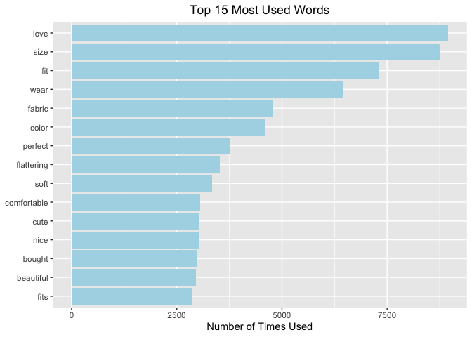
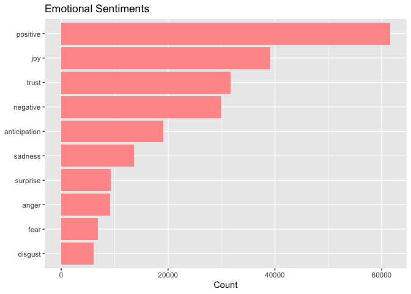

Women’s Clothing Reviews
================
Brittny Huggins
1/26/2022


## Introduction

This Rmarkdown file will be analyzing a womens clothing stores reviews
and

ratings.Ratings and reviews offer powerful insights for the company to
see how

customers feel about their products as well as how they would describe
them. By

using text mining and doing a sentiment analysis we can visually show
the

company how their products are doing.

``` r
options(repos = list(CRAN="http://cran.rstudio.com/"))
install.packages("tidyverse")
```

    ## 
    ## The downloaded binary packages are in
    ##  /var/folders/p_/n9dk52q92ld5svrw21rdqf7w0000gn/T//RtmpI0aDNe/downloaded_packages

``` r
install.packages("tidytext")
```

    ## 
    ## The downloaded binary packages are in
    ##  /var/folders/p_/n9dk52q92ld5svrw21rdqf7w0000gn/T//RtmpI0aDNe/downloaded_packages

``` r
install.packages("wordcloud")
```

    ## 
    ## The downloaded binary packages are in
    ##  /var/folders/p_/n9dk52q92ld5svrw21rdqf7w0000gn/T//RtmpI0aDNe/downloaded_packages

``` r
install.packages("ggforce")
```

    ## 
    ## The downloaded binary packages are in
    ##  /var/folders/p_/n9dk52q92ld5svrw21rdqf7w0000gn/T//RtmpI0aDNe/downloaded_packages

``` r
install.packages("textdata")
```

    ## 
    ## The downloaded binary packages are in
    ##  /var/folders/p_/n9dk52q92ld5svrw21rdqf7w0000gn/T//RtmpI0aDNe/downloaded_packages

``` r
install.packages("reshape2")
```

    ## 
    ## The downloaded binary packages are in
    ##  /var/folders/p_/n9dk52q92ld5svrw21rdqf7w0000gn/T//RtmpI0aDNe/downloaded_packages

``` r
library(dplyr)
library(tidyr)
library(tidytext)
library(tidyverse)
library(wordcloud)
library(ggforce)
library(textdata)
library(reshape2)
library(stats)
```

## Data and Importation

The dataset being analyzed is a Womens Clothing E-Commerce set that
focuses on

customer reviews. The set can be viewed on
[Kaggle](https://www.kaggle.com/nicapotato/womens-ecommerce-clothing-reviews).

This is data from a real retailer, but to keep anonymity the store name
has

been changed to just “retailer”.

``` r
Off_Reviews <- read.csv("Womens Clothing E-Commerce Reviews.csv", stringsAsFactors = FALSE)
```

## Ratings and Recommended

Ratings are important for e-commerce businesses because they provide
benefits

for the customer, the company, and SEO. According to the Vertical Rail,
a

marketing and advertising strategy website, the list of benefits
includes:

**Benefits for Customers**

-   Established more trust in the product and company

-   Gives consumers a voice

-   More interaction on the website

**Benefits for Business**

-   Valuable market research

-   Enhances customer service

-   Increase sales

**Benefits for SEO**

-   Improve rankings

-   New and unique content about your company

-   Keyword rich

Now that we’ve looked at some of the benefits, lets first look at the

percentage of products customers would recommend and the retailer’s
overall

ratings.

``` r
Rec_Plot <- Off_Reviews %>% 
    group_by(Recommended.IND)%>% 
    count() %>% 
    ungroup() %>%
    mutate(perc= `n` / sum(`n`)) %>% 
    arrange(perc) %>% 
    mutate(labels= scales::percent(perc))

 ggplot(Rec_Plot, aes(x = "", y = perc, fill = factor(Recommended.IND))) + 
     geom_col() +
     geom_label(aes(label = labels),
                position = position_stack(vjust = 0.5),
                show.legend = FALSE) +
     coord_polar(theta = "y") +
     theme_void() +
     labs(title= "Percentage of Recommended Products") +
     scale_fill_brewer('Recommended', labels = c("Not Recommended", "Recommended")) +
     theme(plot.title = element_text(hjust = 0.5))
```

<!-- -->

82% of products are being recommended while only 18% aren’t! 18% isn’t
too bad,

but let’s see what departments are contributing the most to the not
recommended

category.

``` r
 Off_Reviews%>% group_by(Department.Name) %>% filter(Recommended.IND == 0) %>% count(Department.Name, sort = TRUE)
```

    ## # A tibble: 6 × 2
    ## # Groups:   Department.Name [6]
    ##   Department.Name     n
    ##   <chr>           <int>
    ## 1 Tops             1935
    ## 2 Dresses          1212
    ## 3 Bottoms           565
    ## 4 Intimate          260
    ## 5 Jackets           169
    ## 6 Trend              31

The most not recommended products come from the tops department.

Next, we’ll analyze the ratings.

``` r
Rating_Chart <- Off_Reviews %>% 
     group_by(Rating)%>% 
     count() %>% 
     ungroup() %>%
     mutate(perc= `n` / sum(`n`)) %>% 
     arrange(perc) %>%
     mutate(labels= scales::percent(perc))


Rating_Plot <- Rating_Chart %>% 
    mutate(end = 2 * pi * cumsum(n)/sum(n),
    start = lag(end, default = 0),
    middle = 0.5 * (start + end),
    hjust = ifelse(middle > pi, 1, 0),
    vjust = ifelse(middle < pi/2 | middle > 3 * pi/2, 0, 1))


ggplot(Rating_Plot) + 
     geom_arc_bar(aes(x0 = 0, y0 = 0, r0 = 0, r = 1,
                     start = start, end = end, fill = factor(Rating))) +
     geom_text(aes(x = 1.05 * sin(middle), y = 1.05 * cos(middle), label = labels,
                  hjust = hjust, vjust = vjust)) +
     coord_fixed() +
     scale_fill_brewer() +
     scale_x_continuous(limits = c(-1.5, 1.5), name = "", breaks = NULL, labels = NULL) +
     scale_y_continuous(limits = c(-1, 1.1),name = "", breaks = NULL, labels = NULL) +
     ggtitle("Product Ratings Percentage") +
     theme(plot.title = element_text(hjust = 0.5))
```

<!-- -->

**55.9%** of products are rated a 5 by customers so, that means for over
half

the products on the site customers are very satisfied. Only **3.6%** of

products are rated a 1(the worst).

**Average Department Rating **

    ##    Group.1 Avg Rating
    ## 1  Bottoms   4.288760
    ## 2 Intimate   4.280115
    ## 3  Jackets   4.264535
    ## 4     Tops   4.172239
    ## 5  Dresses   4.150815
    ## 6    Trend   3.815126

Bottoms Department has the highest average rating for products while the
trend

department has the lowest rated average.

## Text Mining: Word Frequency

Just like ratings, reviews offer the same benefits as above. Reviews
hold

useful information about how customers really feel about your products
and by

using text mining we can see what words are used most by customers when
they’re

writing reviews.

``` r
List <- tibble(line = 1:23486 ,text= Off_Reviews$Review.Text)

xt_words <- tibble(row = 1:43 , words = c("dress","top", "shoes", "boots", "company", "also", "made", "blue", "piece", "shoulders", "skirt", "wearing", "bra", "jacket", "makes", "white", "picture", "time", "imo", "net", "shirt", "tracy", "reese", "hte", "teh", "skirts", "pants",  "store", "pencil", "bit", "Op", "ag", "thighs", "eu", "tank", "trench", "blazer", "coat", "person", "elbow", "kimono", "pair", "pairs"))  

 
 
 Cleaned_Words <- List %>%   #Tokenization of Reviews 
 unnest_tokens(word, text) %>%
 filter(str_detect(word, "[a-z']$"),
 !word %in% xt_words$words,
 !word %in% stop_words$word)                                    
                   
Cleaned_Words %>%
count(word, sort = TRUE) %>% head(15) %>%
filter(n > 600) %>%
mutate(word = reorder(word, n)) %>%
ggplot(aes(n, word, fill= "lightblue")) +
geom_col(fill= "lightblue") +
labs(y = NULL, x= "Number of Times Used") + ggtitle("Top 15 Most Used Words") + theme(plot.title = element_text(hjust = 0.5)) 
```

<!-- -->

``` r
Cleaned_Words %>%
anti_join(stop_words) %>%
count(word) %>%
with(wordcloud(word, n, max.words = 120))
```

    ## Joining, by = "word"

<!-- -->

The top chart shows the **top 15** most used words throughout the site
and

below that is a word cloud of a few words used in the reviews. The
larger the

word font, the more it’s used.

## Sentiment Analysis

The Tidy Text package holds several sentiment lexicons which can be used
to

determine characteristics about tokens which are single words,
sentences, or

messages that are taken from data to be analyzed. The package includes:

-   NRC: assigns English words to emotion

-   Bing: assigns English words to positive or negative categories

-   AFINN: assigns English words to a score of -5 to 5, negative numbers
    = a

negative sentiment and positive numbers = a positive sentiment

``` r
tns <- getNamespace("textdata")
assignInNamespace(x = "printer", value = function(...) 1, ns = tns)

bing <- get_sentiments("bing")
Afinn <- get_sentiments("afinn")
NRC <- get_sentiments("nrc")
```

Let’s start off by analyzing the emotions(NRC) of customer reviews

``` r
NRC_Sent <- Cleaned_Words %>% inner_join(NRC, by= "word") %>% count(sentiment, sort = TRUE)

ggplot(NRC_Sent, aes(x = n , y = reorder(sentiment, n))) + geom_col(fill= "#FF9999") + labs(y= NULL, x = "Count") + ggtitle("Emotional Sentiments")
```

<!-- -->

The above graph shows how tokens contributed to an emotional sentiment.
61,557

of the tokens contributed to the positive sentiment group. Joy came
next, and

then trust.

``` r
Bing_Sent <- Cleaned_Words %>% inner_join(bing, by= "word")
Bing_Pie <- Bing_Sent %>% 
  group_by(sentiment) %>%  
  count() %>% 
  ungroup() %>%                                                                                             
  mutate(perc= `n` / sum(`n`)) %>% 
  arrange(perc) %>% 
  mutate(labels= scales::percent(perc))

ggplot(Bing_Pie, aes(x = "", y = perc, fill = sentiment)) + 
          geom_col() +
          geom_label(aes(label = labels),
                     position = position_stack(vjust = 0.5),
                     show.legend = FALSE) +
          coord_polar(theta = "y") +
          theme_void() +
          labs(title= "Negative vs Positive Sentiment Percentage")
```

<!-- -->

The figure shows that there are more words contributing to the negative

sentiment, **58%**, than the positive sentiment, **48%**.Here are some
of the

words that contributed most to the positive and negative sentiments.

 **Figure 1**

 **Figure 2**

Figure 1 shows the top ten words that contributed most to each
sentiment. Fall

was the top one for the negative sentiment and love is the top one for
the

positive sentiment.

Figure 2 shows a comparison cloud of words that contributed to the
positive and

negative sentiments. The negative words are in red, and the larger words
like

love are the ones that were used the most.

Let’s see which department is considered to be the most positive. By
using

Afinn’s scoring we can see which department contributed the most to the

positive reviews.

``` r
Dept_List <- tibble(line = 1:23486 ,text= Off_Reviews$Review.Text, Dept = Off_Reviews$Department.Name)

C_W <- Dept_List %>%
unnest_tokens(word, text) %>%
filter(str_detect(word, "[a-z']$"), 
!word %in% xt_words$words,
!word %in% stop_words$word)

words_by_dept <- C_W %>% count(Dept, word, sort =  TRUE)%>% ungroup()

Dept_sentiments <- words_by_dept %>%
  inner_join(get_sentiments("afinn"), by = "word") %>%
  group_by(Dept) %>%
  summarize(value = sum(value * n) / sum(n))

Dept_sentiments <- Dept_sentiments[-1, ]

Dept_sentiments %>%
  mutate(Dept = reorder(Dept, value)) %>%
  ggplot(aes(value, Dept, fill = value > 0)) +
  geom_col(show.legend = FALSE) +
  labs(x = "Average sentiment value", y = NULL)
```

<!-- -->

Positive tokens taken from the intimates’ department reviews contributed
most

to the positive sentiment with an average sentiment value of 1.60. The

department that contributed least to the positive sentiment is trend
with an

average sentiment value of 1.32.

## Conclusions

-   Overall, most products are highly rated by customers. The bottoms
    department

carries products that are the highest rated and recommended. Companies
like

Fashion Nova are known for their wonderful jeans, I know because I have
quite a

few pairs. I first saw how good they fit from a girl, and after seeing
the fit

I purchased too. The best way to advertise the bottoms is to reach out
to

influencers on any social media platform and have them promote your
product

with pictures. Include all ages and sizes because that will reach a
wider

audience. For all products, have the recommendation rating and product
rating

right under products so customers will be more inclined to buy.

-   Intimates department is the second highest rated department and the
    reviews

from this department contributed most to the positive sentiment. To
increase

sales, when a customer is looking at a pair of jeans on the site
recommend some

intimates to go with them.

-   The Trend department is the lowest rated and recommended department.
    Also,

this department contributed least to the positive sentiment. This is
most

likely due to the fact that it is the smallest department among the
groups, but

if not revamping the trend department will increase ratings.

-   The fact that positive, joy, and trust are the top emotional
    sentiments means

that generally customers trust and enjoy the products, but anticipation
comes

up right after those so that could mean that customers aren’t getting
products

as fast as they would like. In order to analyze this to see if products
are

taking too long to ship we’d need to have some more data about the
shipping

method, shipping date, and delivery date.

-   There are more words contributing to the negative sentiment than the

positive, but this is could be due to the fact that some words like fall
and

pale can be seen as negatives, but really customers could be talking
about the

season or just the color. The word I’d pay attention to is loose because
it can

be used in a negative or positive way but that is the second word that

contributed most to the negative sentiment. Since the tops department is
the

one with the most non recommended items, the company should take a look

at these products and see if they are too loose.

## References

VerticalRail.*The Benefits of Online Ratings and Reviews for E-commerce
Merchants*.
<http://www.verticalrail.com/wp-content/uploads/2013/01/Benefits-of-Ratings-and-Reviews-W>
hite-Paper.pdf
